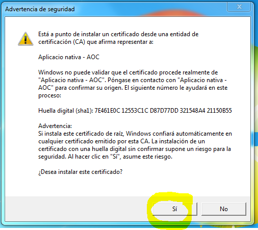
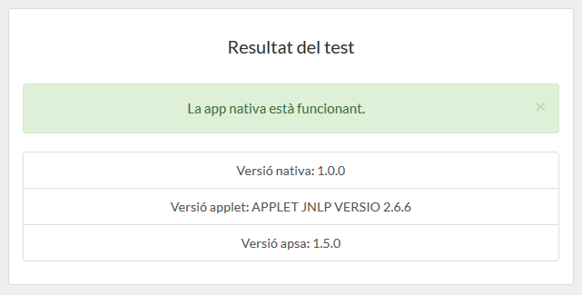
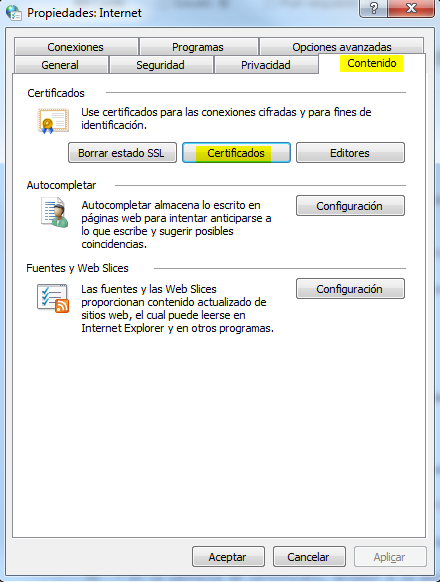
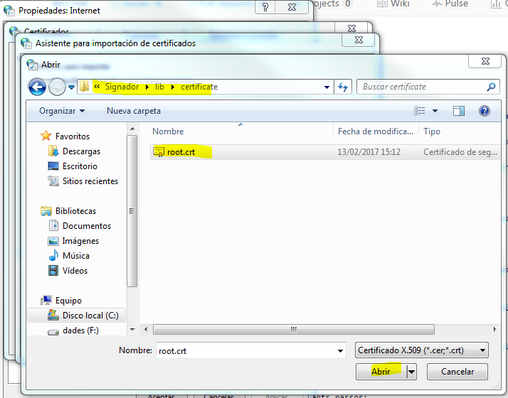
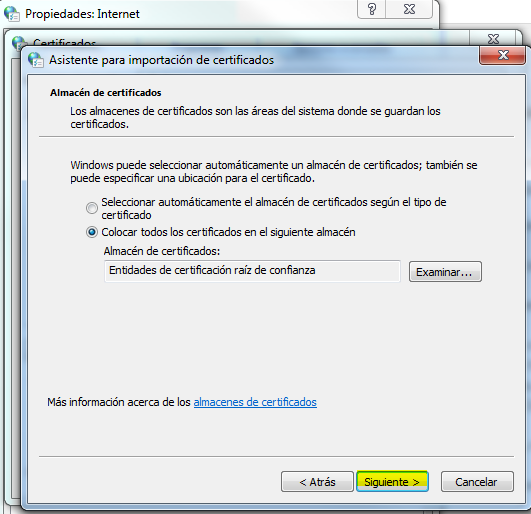
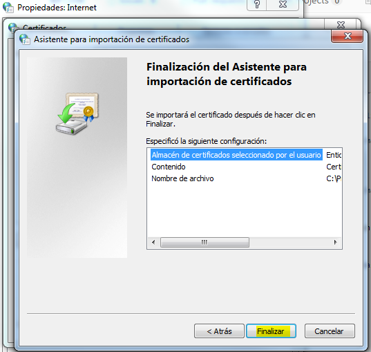
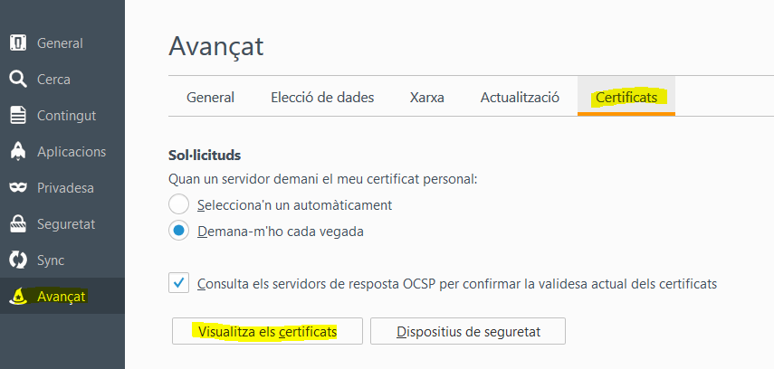
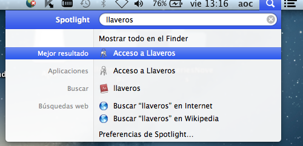
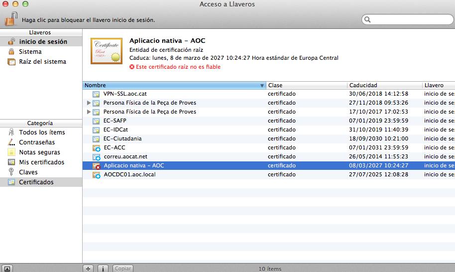
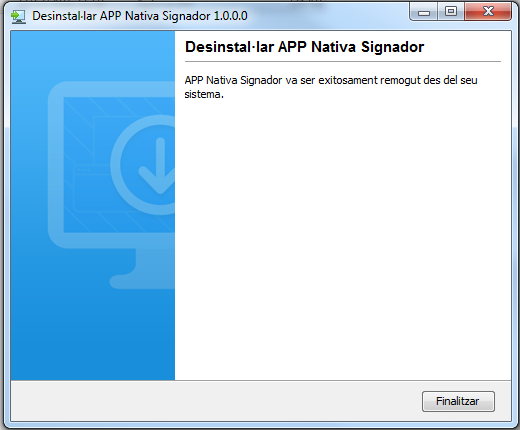

<h2>Què necessito per utilitzar l'<i>Aplicació Nativa</i>?</h2>

L'aplicació nativa és una aplicació d'escriptori que s'instal·la en la màquina del client i s'executa com a servei (en segon pla). 

## 1. Sistemes operatius

Donem suport a la instal·lació i execució de l'aplicació nativa en els següents sistemes operatius:

 - *Ubuntu* - Versions [12.04 i superiors](https://wiki.ubuntu.com/Releases) 
 - *Windows* - Versions client [Vista i superiors](https://en.wikipedia.org/wiki/List_of_Microsoft_Windows_versions#Client_versions)
 - *Windows* - Versions servidor [Server2003 R2 i superiors](https://en.wikipedia.org/wiki/List_of_Microsoft_Windows_versions#Server_versions) - _Windows server 2016 encara no està suportat >> estàra suportat de cara 18/04/2018 a la versió 1.0.0.7 de la nativa_
 - *MAC OS X* - Versions [OS.X 10.9 i superiors](https://en.wikipedia.org/wiki/MacOS#Release_history)
 
**Nota**: Igual que en el cas dels navegadors pot funcionar en altres versions de sistemes operatius (e.g. altres distribucions de Linux com pot ser [Mint](https://www.linuxmint.com/)), però també igual que en el cas dels navegadors, aquestes altres versions no rebran suport per part nostra en cas de problemes d'execució.

### 1.1 Connectivitat

L'aplicació nativa és una aplicació en segon pla que respon les crides que el navegador realitza contra el domini `nativa.aoclocal.cat`. En els nostres servidors de DNS aquesta adreça resol contra `127.0.0.1 (localhost)`. En cas d'entorns corporatius amb firewall, proxies, etc s'hauria de validar la resolució correcte d'aquest domini ja que d'altra manera el servei no podrà conectar amb l'aplicació nativa i sempre presentarà el JNLP com a opció per a realitzar la signatura.

## 2. Descarrega

Per poder-la utilitzar cal que alhora de donar-se d'alta al servei, s'informi que es vol utilitzar la nativa _(allow Native)_. 
Un cop el procés d'alta s'hagi realitzat, ja es pot descarregar la versió de l'aplicació corresponent segons l'entorn que es vulgui utilitzar:

- Entorn [PRE](https://signador-pre.aoc.cat/signador/installNativa)
- Entorn [PRO](https://signador.aoc.cat/signador/installNativa)

En la pàgina d'instal·lació de la nativa l'usuari pot escollir la versió del Sistema Operatiu (tal i com es veu en la següent imatge).

**Nota**: Per defecte el navegador detecta el Sistema Operatiu i es descarrega la versió adequada.

## 3. Instal·lació

Un cop descarregat l'executable procedim a realitzar la instal·lació.

Per instal.lar segueixi els següents passos de l'assistent d'instal·lació:

Un cop s'hagi instal·lat i arranqui l'aplicació, en cas que ho fagis en Windows li apareixerà el següent missatge:

Pel correcte funcionament de l'aplicació ha d'acceptar la instal·lació del certificat.

## 4. Validació

Un cop s'hagi instal·lat l'aplicació nativa, es pot realitzar un simple test de funcionament per comprovar que la instal·lació s'ha realitzat correctament.

- Entorn [PRE](https://signador-pre.aoc.cat/signador/testNativa)
- Entorn [PRO](https://signador.aoc.cat/signador/testNativa)

Si el procés s'ha realitzat correctament la pàgina de test ens mostrarà la següent imatge:

En cas contrari, es mostrarà el següent error:

**NOTES:** 
* Si acabeu d'instal·lar l'aplicació nativa reviseu el següent apartat d'instal·lar el cerfiticat.
* Si el problema persisteix poseu-vos en contacte amb el Suport a Usuari del Consorci AOC.

## 5. Instal·lar Certificat

Perquè funcioni l'aplicació nativa és obligatori que s'instal·li el certificat en el seu navegador o sistema operatiu.

### 5.1 Windows

La càrrega del certificat al magatzem de _Windows_ permet el correcte funcionament de l'aplicació amb Internet explorer, Edge i Chrome.

A més a més en el magatzem de _Windows_ s'instal·la automàticament, tot i que s'ha d'acceptar la instal·lació del certificat mitjançant un popup que apareix durant aquesta. 

En cas que no s'hagi cancel·lat l'instal·lació en aquest popup serà necessari que l'usuari ho faci manualment seguint els següents passos:

* Cerca en el buscador de windows: _Opcions d'internet_

* Obre les Opcions d'internet --> accedeix a la pestanya Contingut --> Certificats

* En la pantalla de certificats, accedir a la pestanya Entitats de Certificació arrel de confiança i clicar a Importar

* En la pantalla d'assistent per la importació de certificats cliqui a següent

* Cliqui a examinar per escollir el certificat a Importar

* Escull el certificat a importar.
El certificat a instal·lar, root.crt, es troba a la carpeta a on s'ha instal·lat l'aplicació nativa, per defecte és a: 
C:\Program Files (x86)\Signador\lib\certificate

* Un cop seleccionat el certificat cliqui a següent

* En la següent pantalla torni a clicar següent

* Cliqui a Finalitzar per importar el certificat

* Torni a realitzar una validació.

### 5.2 Firefox

_Firefox_ disposa del seu propi magatzem de claus, per tant independentment del sistema operatiu sobre el que s'estigui executant, si vol fer servir l'aplicació amb _Firefox_ serà necessari carregar el certificat segueint els següents passos que apliquen per qualsevol sistema operatiu:

* Obrir Firefox --> Accedir a Opcions 

* Avançat --> Certificats --> Visualitza els Certificats

* En la pantalla de certificats, accedir a la pestanya Entitats i clicar a Importar

* Escull el certificat a importar.
El certificat a instal·lar, root.crt, es troba a la carpeta a on s'ha instal·lat l'aplicació nativa, per defecte és a: 

- *Windows 32 bits*  C:\Program Files (x86)\Signador\lib\certificate
- *Windows 64 bits*  C:\Program Files\Signador\lib\certificate
- *Linux 32 bits*   /usr/local/signador
- *Linux 64 bits*   /usr/local/signador
- *MACOSX*  /Applications/Signador.app/Contents/Resources/app/lib/certificate

* Un cop seleccionat el certificat, marqui a confiar per identificar a llocs web

* Torni a realitzar una validació.

### 5.3 MAC OS X

Per a MAC OS X el certificat és carrega de forma automàtica però l'usuari ha de procedir a acceptar-lo manualment amb les passes que es descriuen a continuació:

* Cerca en el buscador de MAC: _llaveros_

* A llaveros escull la categoria certificats, i del llistat escull _root de prova_

* En el certificat, escull la opció confiar sempre.

* Torni a realitzar una validació.

**Nota**: Si el problema persisteix poseu-vos en contacte amb el Suport a Usuari del Consorci AOC.

## 6. Funcionament

Un cop s'ha instal·lat l'aplicació i aquesta funciona correctament, el canvi del funcionament de la versió **JNLP** a la **Nativa** és totalment transparent per l'usuari. 

Els únics canvis són visuals, ja que no es descarrega cap fitxer com en el cas de la versió **JNLP**.
A l'usuari se li mostra un llistat dels certificats dels que disposa i només ha d'escollir el que vol per signar. 
A continuació es mostra un exemple de la pantalla de funcionament del signador en cas de tenir la nativa instal·lada.

## 7. Desinstal·lació

En cas que es vulgui desinstal·lar, s'ha d'accedir a la carpeta a on s'hagi instal·lat la aplicació, executar el fitxer _uninstall.exe_ i seguir els següents passos:

## 8. Troubleshooting

En cas de problemes amb l'execució de l'aplicació nativa podeu obrir una petició a través del nostre [portal de suport](https://www.aoc.cat/suport/) fent una descripció del problema, i afegint la següent informació: *sistema operatiu*, *navegador*, i si és possible els fitxers amb els logs de l'execució que podeu trobar en el path de la instal·lació de la nativa a `$SIGNADOR_HOME/log/webappTemp.log` i `$SIGNADOR_HOMER/error.log`.

En el cas de sistemes operatius Windows, seguint la instal·lació per defecte, la variable `$SIGNADOR_HOME` pren el valor `C:\Program Files (x86)\Signador` per a l'instal·lable de _32-bit_ i `C:\Program Files\Signador` per al de _64-bit_. Per tant els fitxers de logs els trobareu a `C:\Program Files (x86)\Signador\log\webappTemp.log`,`C:\Program Files (x86)\Signador\error.log` i `C:\Program Files\Signador\log\webappTemp.log` i `C:\Program Files\Signador\error.log` respectivament.
