<h2>Què necessito per utilitzar l'<i>Aplicació Nativa</i>?</h2>

L'aplicació nativa és una aplicació d'escriptori que s'instal·la en la màquina del client i s'executa com a servei (en segon pla).

L'aplicació de la nativa es distribueix sota el termes de la [llicencia del MIT](../LICENSE.MD)

## 1. Sistemes operatius

Donem suport a la instal·lació i execució de l'aplicació nativa en els següents sistemes operatius:

 - *Ubuntu* - Versions [14.04 i superiors](https://wiki.ubuntu.com/Releases) 
 - *Windows* - Versions client [7 i superiors](https://en.wikipedia.org/wiki/List_of_Microsoft_Windows_versions#Client_versions)
 - *Windows* - Versions servidor [Server2008 i superiors](https://en.wikipedia.org/wiki/List_of_Microsoft_Windows_versions#Server_versions)
 - *MAC OS X* - Versions [OS.X 10.12 i superiors](https://en.wikipedia.org/wiki/MacOS#Release_history)
 
Indicar que aquest llistat s'anirà actualitzant, però no es donarà suport sobre sistemes operatius les versions dels quals hagin estat declarades obsoletes - [*EOL*](https://en.wikipedia.org/wiki/End-of-life_(product)) - per el propi fabricant.
 
**Nota**: Igual que en el cas dels navegadors pot funcionar en altres versions de sistemes operatius (e.g. altres distribucions de Linux com pot ser [Mint](https://www.linuxmint.com/)), però també igual que en el cas dels navegadors, aquestes altres versions no rebran suport per part nostra en cas de problemes d'execució.

### 1.1 Connectivitat

L'aplicació nativa és una aplicació en segon pla que respon a les crides que el navegador realitza contra el domini `nativa.aoclocal.cat`. En els nostres servidors de DNS d'aquesta adreça resol contra `127.0.0.1 (localhost)`. En cas d'entorns corporatius amb firewall, proxies, etc s'hauria de validar la resolució correcte d'aquest domini ja que d'altra manera el servei no podrà conectar amb l'aplicació nativa i sempre presentarà el _JNLP_ com a opció per a realitzar la signatura.

## 2. Descarrega

Per poder-la utilitzar cal que a l'hora de donar-se d'alta al servei, s'informi que es vol utilitzar la nativa _(allow Native)_. 
Un cop el procés d'alta s'hagi realitzat, ja es pot descarregar la versió de l'aplicació corresponent segons l'entorn que es vulgui utilitzar:

- Entorn [PRE](https://signador-pre.aoc.cat/signador/installNativa)
- Entorn [PRO](https://signador.aoc.cat/signador/installNativa)

En la pàgina d'instal·lació de la nativa l'usuari pot escollir la versió del Sistema Operatiu (tal i com es veu en la següent imatge).


**Nota**: Per defecte el navegador detecta el Sistema Operatiu i es descarrega la versió adequada.

**Nota 2**: En aquest enllaç https://github.com/ConsorciAOC/signador/releases podeu trobar en alguns casos release de proves que encara no s'han publicat al web (però que ho faran en breu) i que en alguns casos poden resoldré alguna causística o problema concret. Cal tenir en compte també que de vegades aquestes versions poden necessitar d'un canvi al web que encara no s'ha produït i poden no funcionar, en les _notes_ de la release trobareu l'avís si és el cas.

## 3. Instal·lació

Un cop descarregat l'executable procedim a realitzar la instal·lació. A continuació trobareu la instal·lació per a cadascún dels sistemes operatius suportats:

* [3.1 Windows](#31-windows)
* [3.2 MACOSX](#32-mac-os-x)
* [3.3 Ubuntu](#33-ubuntu)

## 3.1 Windows 

Un cop descarregat l'instal·lable per a Windows només cal fer doble clic sobre el mateix i seguir els següents passos de l'assistent d'instal·lació:

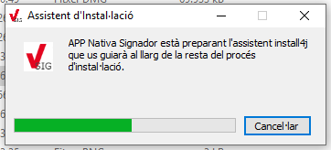


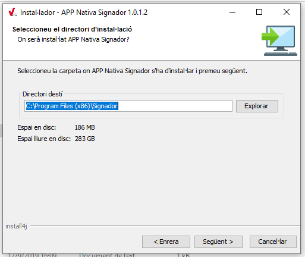


En aquesta pantalla apareixen les següents opcions:

* La primera permet indicar si es desitja que cada vegada que el PC arrenqui es comprovi si existeix una nova versió de l'aplicació nativa. Hi ha alguns entorns on el control/permisos de la instal·lació no las té el propi usuari sinó un usuari administrador, amb el que és molest que aparegui el missatge d'actualització quan en realitat no es diposa de permisos per dur-la a terme, en aquests casos, es possible que l'usuari vulgui evitar les comprovacions de les actualitzacions i ho pot fer desactivant aquesta opció. Per a la resta de casos recomanem tenir l'opció d'actualitzacions seleccionada.
* La segona opció permet indicar si es desitja signar des de _Firefox_ emprant els certificats del propi navegador, en cas que només es vulgui signar fent servir els certificats del propi sistema operatiu podem deixar l'opció desmarcada.

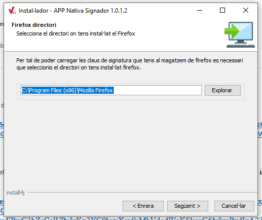

Us apareixerà aquesta pantalla només en cas d'haver seleccionat l'opció per a signar des de _Firefox_ emprant els certificats del navegador, és necessari indicar la ruta on aquest està instal·lat per tal de que es puguin accedir a les llibreries necessàries corresponents a la versió del navegador de l'usuari per evitar errors durant les carregues. Tingueu en compte que si esteu duent a terme la instal·lació de la nativa de 32/64 bits, la ruta de _Firefox_ que indiqueu s'ha de correspondre. En aquest mateix pas es farà la comprovació pertinent, en cas que la versió de la nativa i de _Firefox_ no és correspongui mostrarà el següent error: 


En cas que això us passi, haureu d'instal·lar la versió de la nativa amb l'arquitectura que és correspongui a la vostra versió de _Firefox_.


Un cop s'hagi instal·lat i arrenqui l'aplicació, en cas que ho faci en Windows li apareixerà el següent missatge:


Pel correcte funcionament de l'aplicació ha d'acceptar la instal·lació del certificat. En aquest cas això permetra utilitzar l'aplicació des del _Chrome_, _Edge_, i _Explorer_.

Si a més a més es vol fer servir la nativa en Windows sobre _Firefox_ cal carregar la clau generada al magatzem de confiança del propi _Firefox_, aquest pas només és necessari fer-lo una única vegada. Podeu veure les instruccions al apartat [5.2 Firefox](#52-firefox).

## 3.2 MAC OS X

# TODO

## 3.3 Ubuntu

La operació d'instal·lació a Ubuntu s'ha de fer amb l'usuari que utilitzarà l'aplicació i el que tingui les claus amb les que desitja signar carregades al magatzem de claus del firefox.

Amb l'usuari amb el que volem fer la instal·lació i amb el que hagim descarregat l'instal·lador, cerquem l'instal·lador i donem permissos d'execució:

`chmod 754 AppNativaSignador-x64.sh`

Ara ja podem executar l'instal·lador:

`./AppNativaSignador-x64.sh`

A partir d'aqui podràs instal·lar l'aplicatiu seguint les passes de l'instal·lador:


Proposa l'instal·lació en la `/home` de l'usuari:

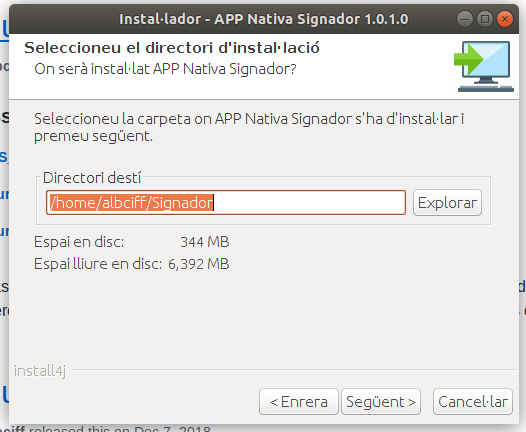

Permet desactivar la comprovació d'actualitzacions a l'iniciar l'aplicació:

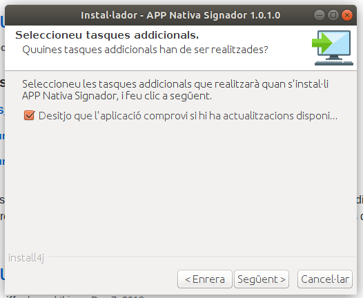

La selecció d'aquesta ruta és important, s'ha de seleccionar el directori d'instal·lació on es troba el firefox, d'altre manera l'aplicació no serà capaç de carregar els certificats d'aquest magatzem:

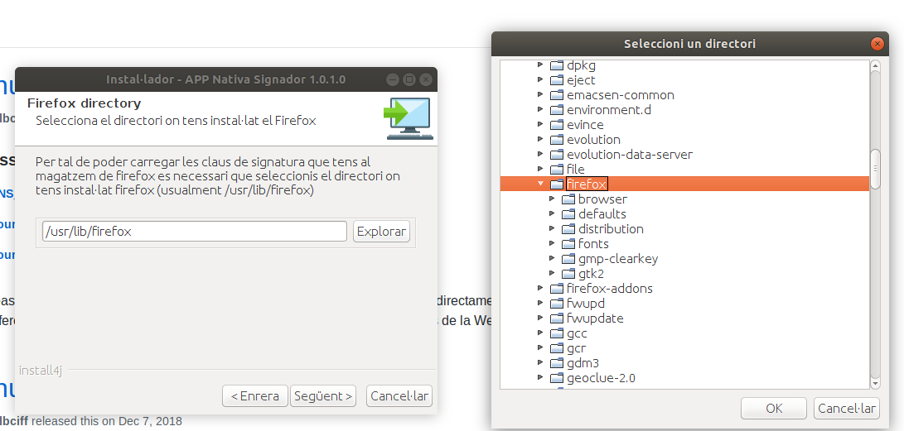

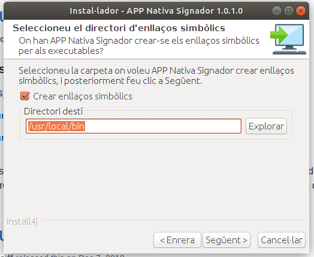

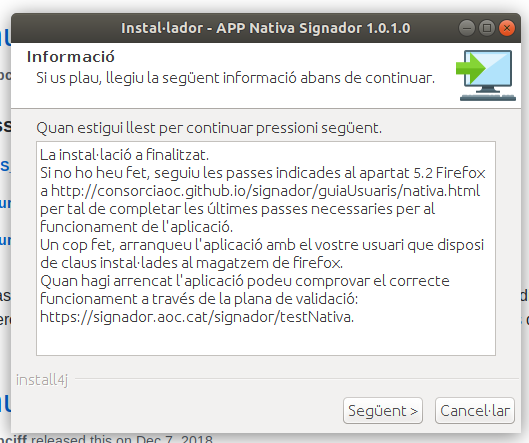

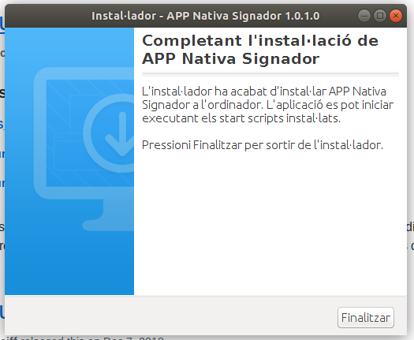

Un cop instal·lat, l'instal·lador no arrenca l'aplicatiu de la nativa. Per tal de fer-ho caldrà anar al directori de l'instal·lació (per defecte `$HOME/Signador`) i arrencar l'aplicació. Ho podeu fer amb la següent comanda:

`$HOME/Signador/Signador`

Cada cop que arrenqueu el sistema i vulgueu fer ús de la nativa, haureu d'arrencar-la amb aquesta comanda.

La primera vegada que l'aplicació s'executa genera les claus necessaries per al seu funcionament, aquest procés només és fa el primer cop que arrenca, la resta de vegades aprofita les claus ja generades.

Abans de fer la validació, en el cas d'Ubuntu, serà necessari carregar la clau generada al magatzem de confiança del navegador, aquest pas només és necessari fer-lo una única vegada. Podeu veure les instruccions al apartat [5.2 Firefox](#52-firefox)

## 4. Validació

Un cop s'hagi instal·lat l'aplicació nativa, es pot realitzar un simple test de funcionament per comprovar que la instal·lació s'ha realitzat correctament.

- Entorn [PRE](https://signador-pre.aoc.cat/signador/testNativa)
- Entorn [PRO](https://signador.aoc.cat/signador/testNativa)

Si el procés s'ha realitzat correctament la pàgina de test ens mostrarà la següent imatge:


En cas contrari, es mostrarà el següent error:


**NOTES:** 
* Si acabeu d'instal·lar l'aplicació nativa reviseu el següent apartat d'instal·lar el cerfiticat.
* Si el problema persisteix poseu-vos en contacte amb el Suport a Usuari del Consorci AOC.

## 5. Instal·lar Certificat

Perquè funcioni l'aplicació nativa és obligatori que s'instal·li el certificat en el seu navegador o sistema operatiu.

### 5.1 Windows

La càrrega del certificat al magatzem de _Windows_ permet el correcte funcionament de l'aplicació amb Internet explorer, Edge i Chrome.

A més a més en el magatzem de _Windows_ s'instal·la automàticament, tot i que s'ha d'acceptar la instal·lació del certificat mitjançant un popup que apareix durant aquesta. 

En cas que no s'hagi cancel·lat l'instal·lació en aquest popup serà necessari que l'usuari ho faci manualment seguint els següents passos:

* Cerca en el buscador de windows: _Opcions d'internet_


* Obre les Opcions d'internet --> accedeix a la pestanya Contingut --> Certificats


* En la pantalla de certificats, accedir a la pestanya Entitats de Certificació arrel de confiança i clicar a Importar


* En la pantalla d'assistent per la importació de certificats cliqui a següent

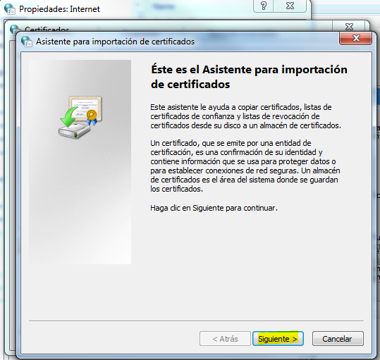

* Cliqui a examinar per escollir el certificat a Importar


* Escull el certificat a importar.
El certificat a instal·lar, root.crt, es troba a la carpeta a on s'ha instal·lat l'aplicació nativa, per defecte és a: 
C:\Program Files (x86)\Signador\lib\certificate


* Un cop seleccionat el certificat cliqui a següent

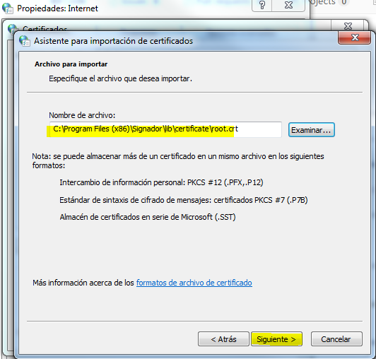

* En la següent pantalla torni a clicar següent


* Cliqui a Finalitzar per importar el certificat


* Torni a realitzar una validació.

### 5.2 Firefox

_Firefox_ disposa del seu propi magatzem de claus, per tant independentment del sistema operatiu sobre el que s'estigui executant, si vol fer servir l'aplicació amb _Firefox_ serà necessari carregar el certificat segueint els següents passos que apliquen per qualsevol sistema operatiu:

* Obrir Firefox --> Accedir a Opcions 

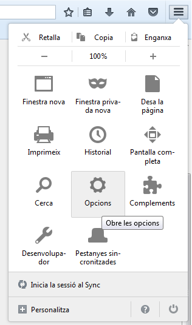

* Avançat --> Certificats --> Visualitza els Certificats


* En la pantalla de certificats, accedir a la pestanya Entitats i clicar a Importar

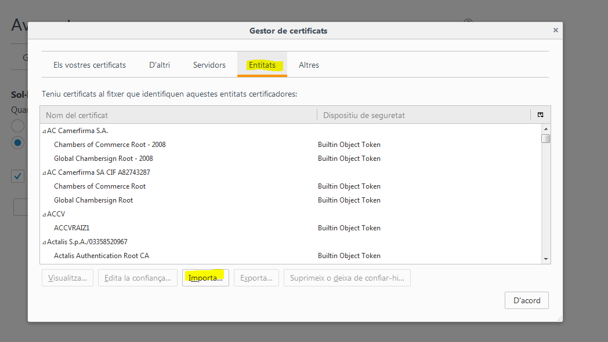

* Escull el certificat a importar.
El certificat a instal·lar, root.crt, es troba a la carpeta a on s'ha instal·lat l'aplicació nativa, per defecte és a: 

- *Windows 32 bits*  C:\Program Files (x86)\Signador\lib\certificate
- *Windows 64 bits*  C:\Program Files\Signador\lib\certificate
- *Linux 32 bits*   $HOME/Signador/lib/certificate
- *Linux 64 bits*   $HOME/Signador/lib/certificate
- *MACOSX*  /Applications/Signador.app/Contents/Resources/app/lib/certificate


* Un cop seleccionat el certificat, marqui a confiar per identificar a llocs web

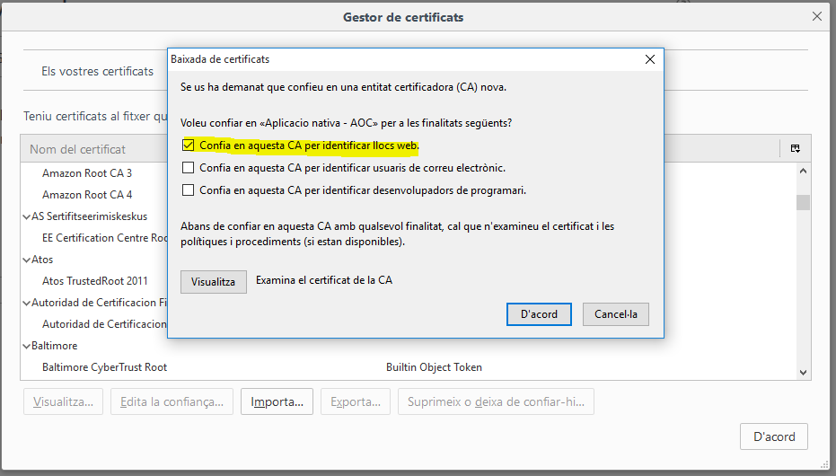

* Torni a realitzar una validació.

### 5.3 MAC OS X

Per a MAC OS X el certificat és carrega de forma automàtica però l'usuari ha de procedir a acceptar-lo manualment amb les passes que es descriuen a continuació:

* Cerca en el buscador de MAC: _llaveros_


* A llaveros escull la categoria certificats, i del llistat escull _root de prova_


* En el certificat, escull la opció confiar sempre.

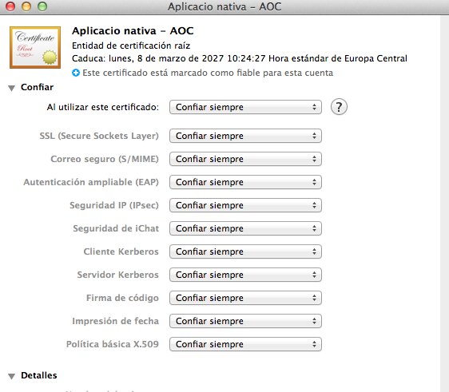

* Torni a realitzar una validació.

**Nota**: Si el problema persisteix poseu-vos en contacte amb el Suport a Usuari del Consorci AOC.

## 6. Funcionament

Un cop s'ha instal·lat l'aplicació i aquesta funciona correctament, el canvi del funcionament de la versió **JNLP** a la **Nativa** és totalment transparent per l'usuari. 

Els únics canvis són visuals, ja que no es descarrega cap fitxer com en el cas de la versió **JNLP**.
A l'usuari se li mostra un llistat dels certificats dels que disposa i només ha d'escollir el que vol per signar. 
A continuació es mostra un exemple de la pantalla de funcionament del signador en cas de tenir la nativa instal·lada.

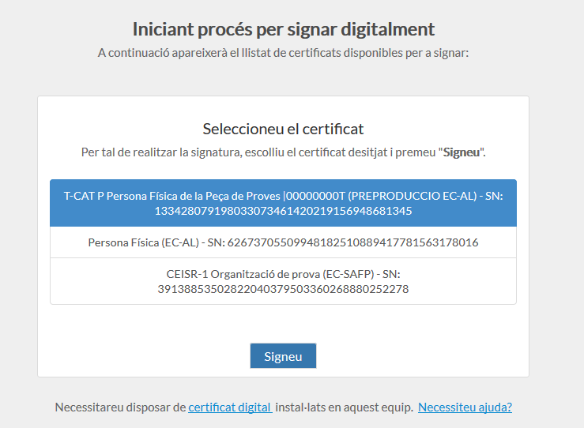

## 7. Desinstal·lació

En cas que es vulgui desinstal·lar, s'ha d'accedir a la carpeta a on s'hagi instal·lat la aplicació, executar el fitxer _uninstall.exe_ i seguir els següents passos:

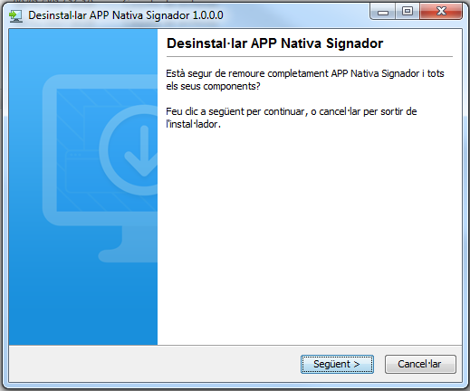


## 8. Configuració avançada

### 8.1 PKCS11 addicionals

En cas que fent ús del signador a través del magatzem de Firefox, el signador no detecti algun certificat carregat en un dispositiu PKCS11, es pot intentar indicar al signador a través d'un paràmetre de configuració la llibreria d'aquest per tal de que la carregui.

Per tal de fer-ho, cal afegir la ruta amb el _.so (linux) o la .dll (windows)_ de la llibreria nativa del dispositiu PKCS11 al fitxer `$SIGNADOR_HOME/Signador.vmoptions`, mitjançant el següent paràmetre: `-Duser.pkcs11.path=/path/al/teu/pkcs11.so`.

El fitxer `Signador.vmoptions` té un contingut similar a:

```
-Duser.firefox.dir=/usr/lib/firefox
-Djava.net.useSystemProxies=true
-Djavax.net.ssl.trustStore=/home/albert/Signador/lib/certificate/cacerts
```

Només caldria afegir doncs una línia extra indicant la ruta a la llibreria de la següent forma:

```
-Duser.pkcs11.path=/path/al/teu/pkcs11.so << AQUEST ÉS EL PARÀMETRE
-Duser.firefox.dir=/usr/lib/firefox
-Djava.net.useSystemProxies=true
-Djavax.net.ssl.trustStore=/home/albert/Signador/lib/certificate/cacerts
```

## 9. Troubleshooting

En cas de problemes amb l'execució de l'aplicació nativa podeu obrir una petició a través del nostre [portal de suport](https://www.aoc.cat/suport/) fent una descripció del problema, i afegint la següent informació: *sistema operatiu*, *navegador*, i si és possible els fitxers amb els logs de l'execució que podeu trobar en el path de la instal·lació de la nativa a `$SIGNADOR_HOME/log/webappTemp.log` i `$SIGNADOR_HOME/error.log`.

En el cas de sistemes operatius Windows, seguint la instal·lació per defecte, la variable `$SIGNADOR_HOME` pren el valor `C:\Program Files (x86)\Signador` per a l'instal·lable de _32-bit_ i `C:\Program Files\Signador` per al de _64-bit_. Per tant els fitxers de logs els trobareu a `C:\Program Files (x86)\Signador\log\webappTemp.log`,`C:\Program Files (x86)\Signador\error.log` i `C:\Program Files\Signador\log\webappTemp.log` i `C:\Program Files\Signador\error.log` respectivament.

En el cas de sistema operatiu Ubuntu, la variable `$SIGNADOR_HOME` en la instal·lació per defecte pren el valor `$HOME\Signador` i podeu accedir a la carpeta dels logs amb la comanda `cd $HOME\Signador\` per a trobar el fitxer `error.log` i la comanda `cd $HOME\Sigandor\log` per a trobar el fitxer `webappTemp.log`.
